# LLM Inference on Bare Metal — Complete Flowchart

> **Purpose:** A detailed, industry-level reference diagram showing every stage of
> running a large language model on a single machine — from loading weights off disk
> to emitting the final token. This documents the *target architecture* of the
> bare-metal-llm-engine project, independent of what has been implemented so far.
>
> **Audience:** The project author, the mentor, and anyone reviewing the project who
> needs to understand the full inference pipeline at a glance.

---

## 1. End-to-End Inference Pipeline (Top Level)

This is the bird's-eye view. Each box expands into its own detailed sub-diagram below.

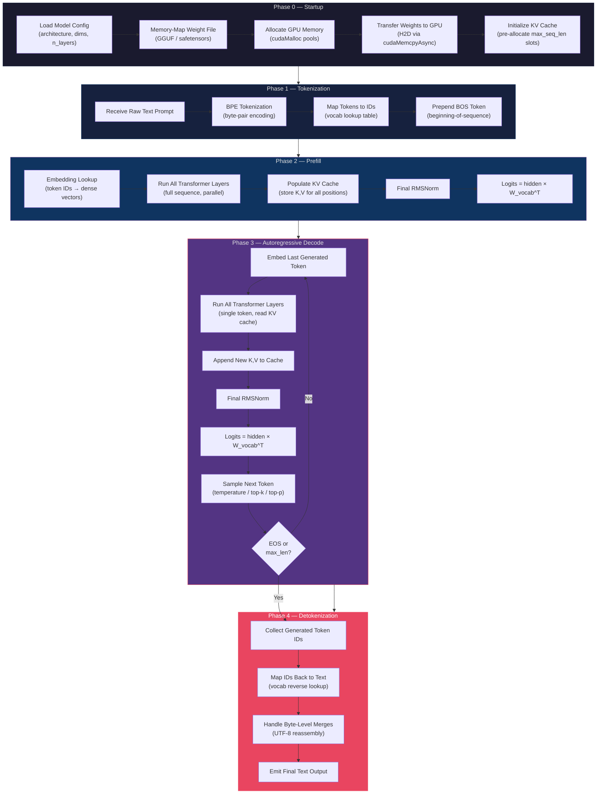

---

## 2. Model Loading — Weight Format and GPU Transfer

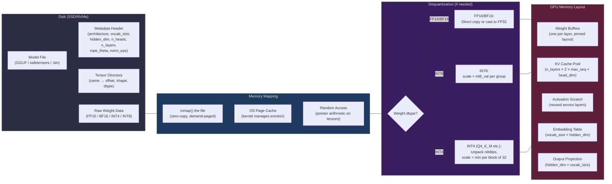

---

## 3. BPE Tokenization Pipeline

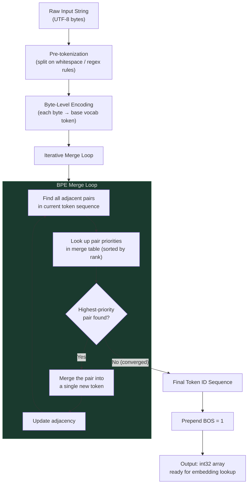

---

## 4. Single Transformer Layer (The Core Compute)

This is where 99%+ of the FLOPs happen. A LLaMA-style layer is shown.

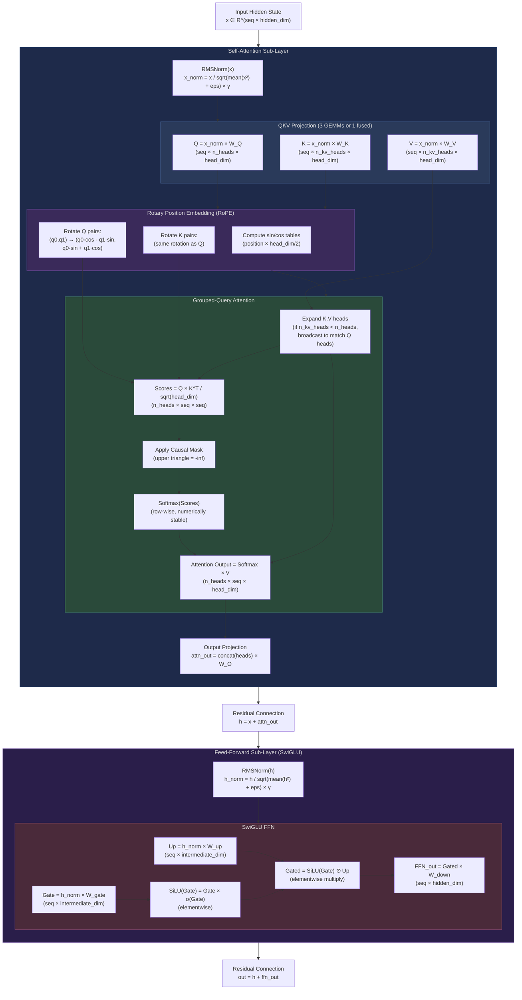

---

## 5. KV Cache — Prefill vs Decode

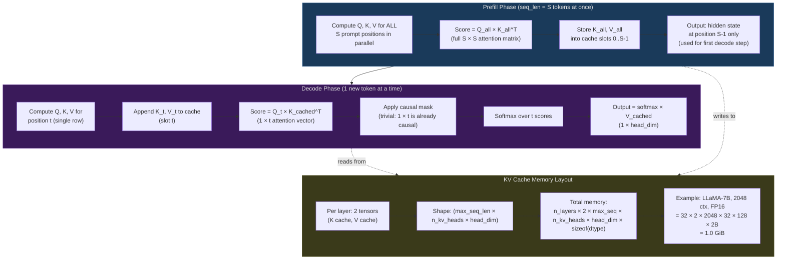

---

## 6. Token Sampling Strategies

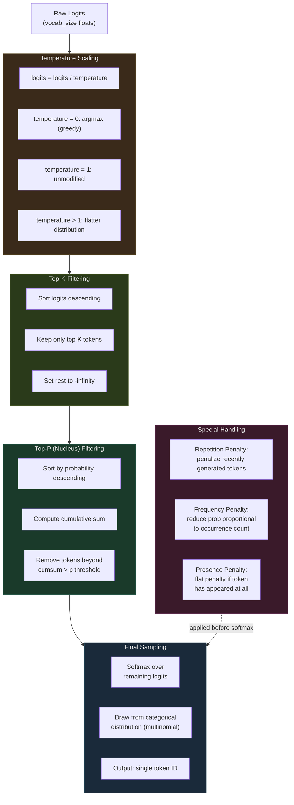

---

## 7. GPU Kernel Execution — Memory Hierarchy

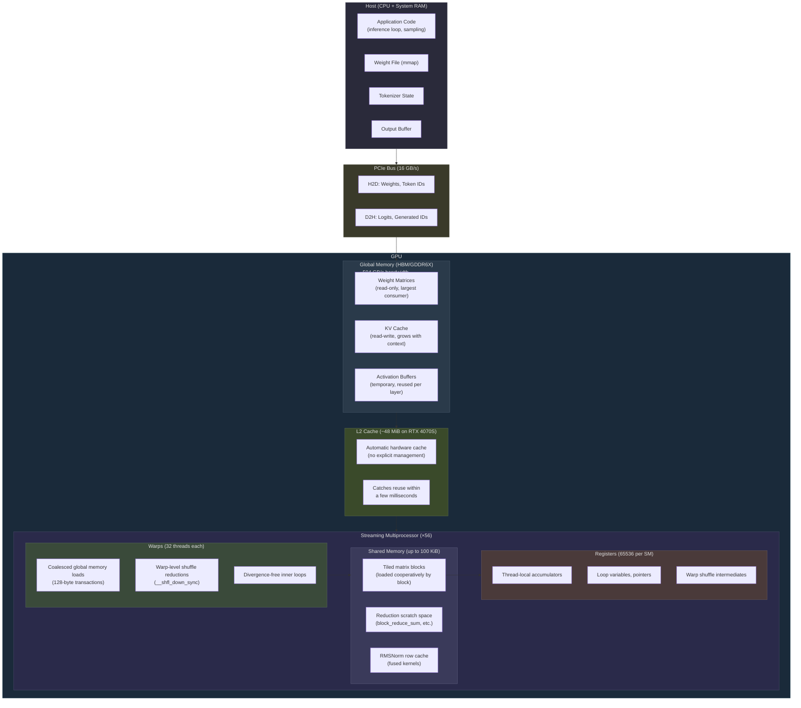

---

## 8. Kernel Fusion Opportunities in the Transformer

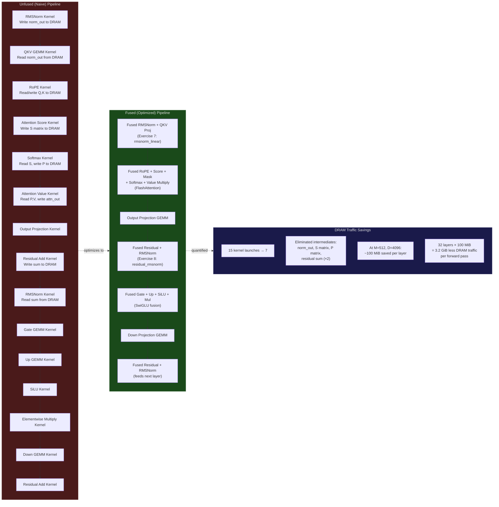

---

## 9. Quantization — From FP16 to INT4

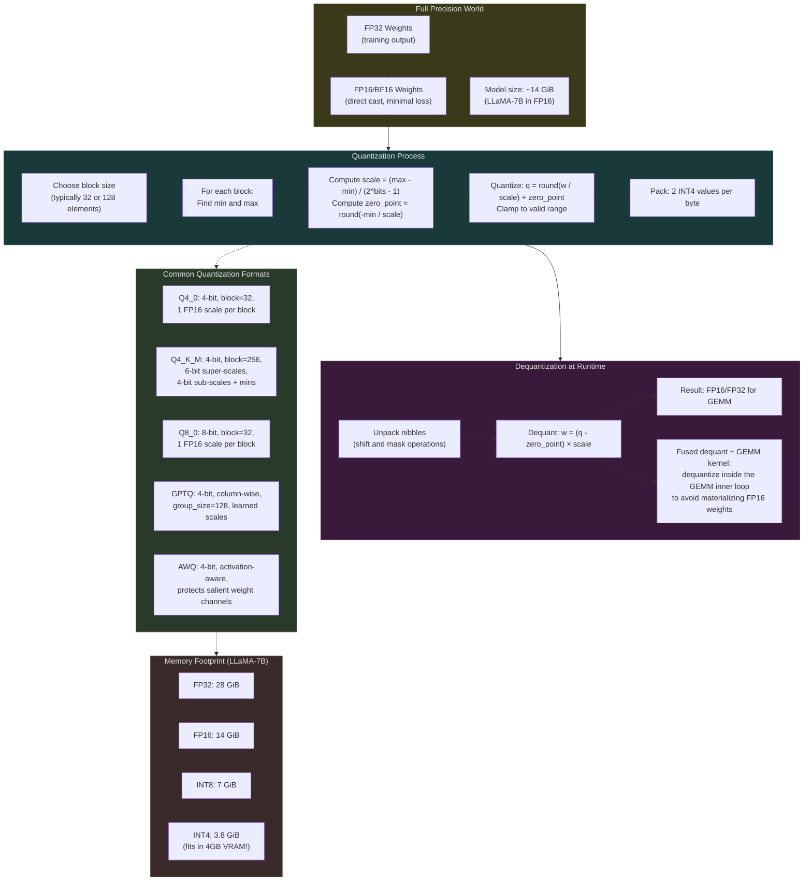

---

## 10. Full Autoregressive Decode Loop — Timing Breakdown

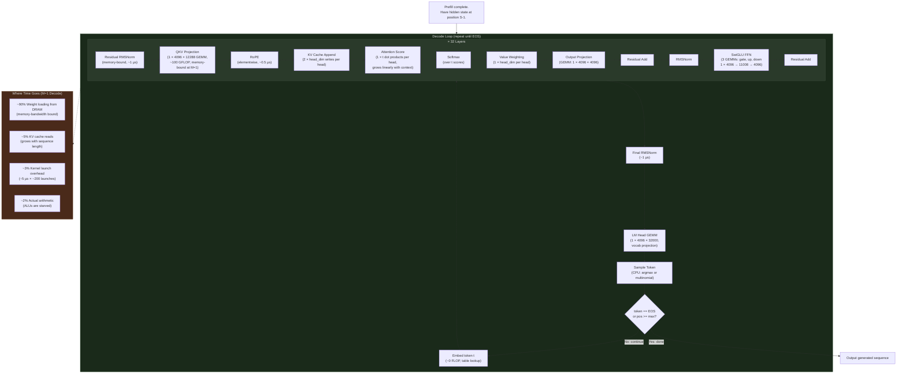

---

## 11. Performance Bound Analysis — Roofline Model

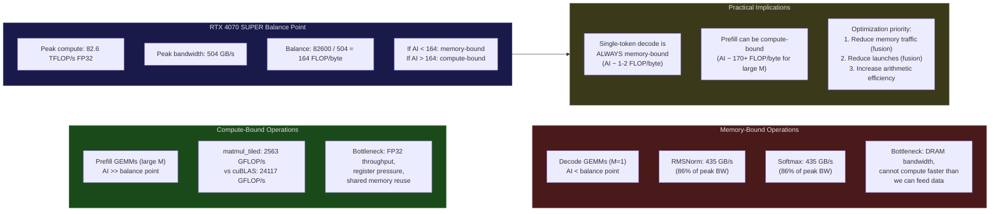

---

## Legend

| Symbol | Meaning |
|--------|---------|
| Solid arrow (`-->`) | Data flow / execution order |
| Dashed arrow (`-.->`) | Conceptual relationship / annotation |
| Rectangular box | Computation step |
| Diamond `{ }` | Decision / branch |
| Subgraph | Logical grouping of related steps |
| `⊙` | Elementwise (Hadamard) product |
| `×` | Matrix multiplication |
| `σ(x)` | Sigmoid function: `1 / (1 + exp(-x))` |
| `SiLU(x)` | `x × σ(x)` — Sigmoid Linear Unit |
| `AI` | Arithmetic Intensity (FLOP / byte) |

---

> **Note:** This flowchart describes the LLaMA / Llama-2 / Mistral family architecture
> specifically, as that is the target of the bare-metal-llm-engine project. Other
> architectures (GPT-2, Falcon, MPT) differ in details (LayerNorm vs RMSNorm, MHA vs GQA,
> GELU vs SiLU, parallel vs sequential attention+FFN) but share the same high-level
> structure of embedding → N × transformer layer → logits → sample → loop.

---

## 12. Streaming Detokenization & UTF-8 Reassembly Buffer

In real-world inference systems, tokens are streamed to the client immediately as they are generated rather than waiting for EOS. Because BPE vocabularies partition arbitrary byte sequences, multi-byte Unicode characters (e.g., emojis or CJK characters spanning 2–4 bytes) are frequently split across multiple consecutive tokens. Emitting decoded text without reassembly causes unicode decoding errors or corrupt replacement characters (`\uFFFD`).

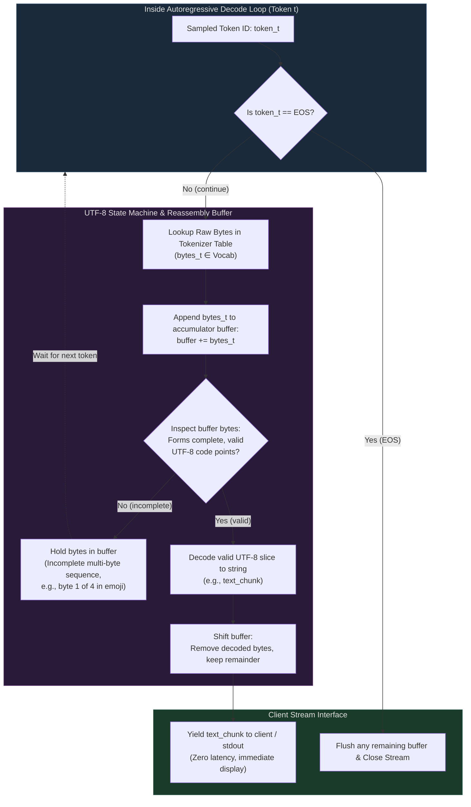

---

## 13. CUDA Graphs & Runtime Orchestration (Zero-Overhead Decode)

In single-token decode ($M=1$), the GPU executes kernels in fractions of a microsecond. Issuing ~15–20 kernels per layer across 32 layers requires ~500–600 individual CUDA kernel launches per token. CPU driver launch latency (~3–5 µs per launch) starves the GPU. Industry engines eliminate this bottleneck by baking the entire decode loop into a pre-compiled **CUDA Graph**.

```mermaid
flowchart TB
    subgraph WARMUP["1. Capture Phase (Run Once at Startup)"]
        W0["Allocate static device memory for M=1 decode:<br/>d_token_id, d_logits, d_kv_cache, d_scratch"]
        W1["cudaStreamBeginCapture(stream, cudaStreamCaptureModeGlobal)"]
        W2["Execute complete forward pass (all 32 layers):<br/>- RMSNorm, QKV GEMV, RoPE<br/>- KV append, Attention, Output GEMV<br/>- SwiGLU FFN (Gate/Up/Down GEMV)"]
        W3["cudaStreamEndCapture(stream, &graph)"]
        W4["cudaGraphInstantiate(&graphExec, graph, 0)<br/>(Bakes topology directly into GPU command processor list)"]
        W0 --> W1 --> W2 --> W3 --> W4
    end

    subgraph EXEC["2. Execution Phase (Autoregressive Loop per Token)"]
        E0["Host updates input token ID in pinned memory<br/>or async H2D copy to static d_token_id"]
        E1["Update dynamic graph node parameters if needed<br/>(e.g., current sequence position slot t)"]
        E2["cudaGraphLaunch(graphExec, stream)<br/>(Single IOCTL / kernel dispatch call for all 32 layers)"]
        E3["Logits ready on device: d_logits<br/>Launch sampling kernel directly on stream"]
        E0 --> E1 --> E2 --> E3
    end

    subgraph COMPARISON["Dispatch Latency Comparison"]
        direction LR
        subgraph STANDARD["Standard Sequential Decode Step"]
            S_CPU["CPU launches ~200 kernels sequentially"]
            S_TIME["CPU overhead: ~500–1000 µs<br/>(CPU throttles GPU execution)"]
            S_CPU --> S_TIME
        end
        subgraph GRAPHED["CUDA Graph Decode Step"]
            G_CPU["CPU launches 1 single graph"]
            G_TIME["CPU overhead: ~10–15 µs<br/>(GPU fully saturated at 100% memory BW)"]
            G_CPU --> G_TIME
        end
    end

    W4 --> E0
    E3 -.-> COMPARISON

    style WARMUP fill:#1a3a3a,stroke:#2a5a5a,color:#e0e0e0
    style EXEC fill:#2a3a1a,stroke:#4a5a2a,color:#e0e0e0
    style STANDARD fill:#4a1a1a,stroke:#6a2a2a,color:#e0e0e0
    style GRAPHED fill:#1a4a1a,stroke:#2a6a2a,color:#e0e0e0
```

---

## 14. FlashAttention & Online Softmax Algorithm (SRAM Tiling)

Standard self-attention materializes the $S \times S$ attention matrix in GPU DRAM, requiring $O(S^2)$ memory reads and writes. FlashAttention solves this via **tiling in Shared Memory (SRAM)** and the **Online Softmax** algorithm, which updates running row statistics on-the-fly without ever writing intermediate scores to global DRAM.

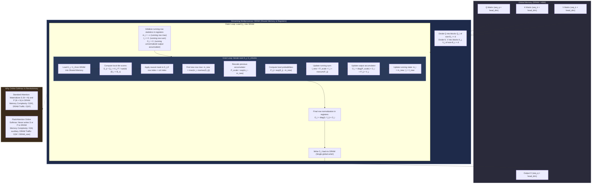

---

## 15. FlashDecoding for Long-Context Decode (M=1 Parallelism)

FlashAttention parallelizes across batch size and query attention heads. In the prefill phase ($M=S$), there is abundant query parallelism. In the decode phase ($M=1$), a batch of 1 with 32 heads provides only 32 thread blocks—leaving modern GPUs with 56 SMs (RTX 4070S) or 132 SMs (H100) severely underutilized. **FlashDecoding** solves this by parallelizing across the KV sequence length dimension.

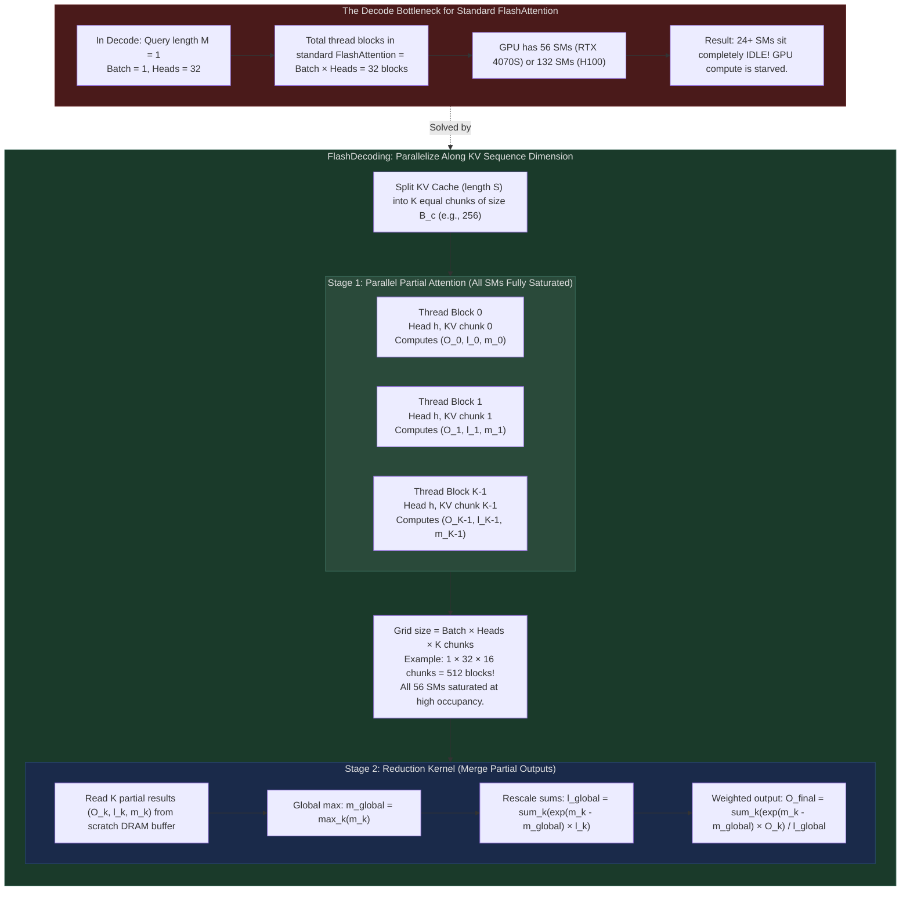

---

## 16. PagedAttention & Dynamic KV Cache Memory Management

Static contiguous KV cache allocation pre-reserves memory for `max_seq_len` tokens per sequence. In production, request lengths vary wildly, leading to 60–80% VRAM waste due to internal and external fragmentation. Inspired by OS virtual memory paging, **PagedAttention** partitions the KV cache into fixed-size physical blocks allocated dynamically.

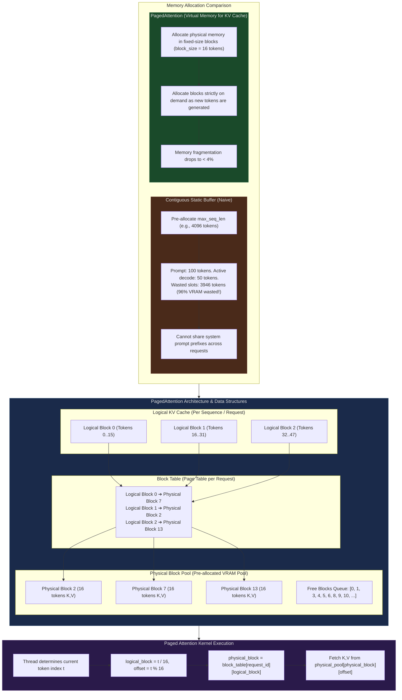

---

## 17. KV Cache Quantization (FP8 & INT8)

As context windows extend to 32k–128k tokens, the memory occupied by the KV cache surpasses the model weights themselves. Quantizing the KV cache to 8 bits (FP8 or INT8) cuts memory traffic and footprint in half, allowing models to support double the context length or double the concurrent batch size.

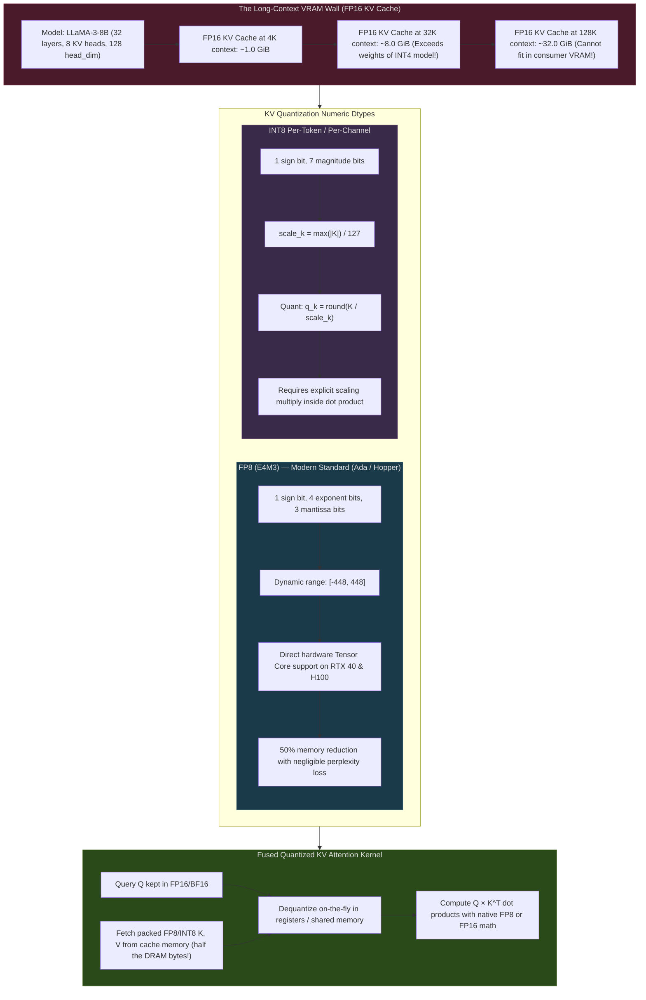

---

## 18. Speculative Decoding Architecture

Because single-token autoregressive decode is strictly memory-bandwidth bound (reading all ~14 GB of weights for every single token), it cannot saturate modern compute cores. **Speculative Decoding** solves this by pairing a fast draft model with the target model, using the target model to verify $K$ tokens in a single parallel, compute-bound forward pass.

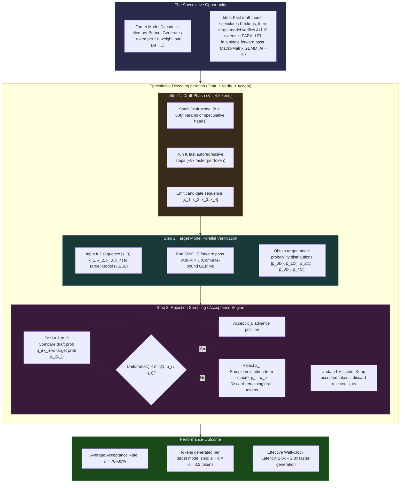

---

## 19. Continuous Batching & Chunked Prefill (Serving Architecture)

When scaling inference beyond a single user to a multi-tenant serving system, traditional static batching introduces massive idle time because requests have heterogeneous lengths. Industry engines use **Continuous (Iteration-Level) Batching** and **Chunked Prefill** to maximize throughput while maintaining tight latency guarantees.

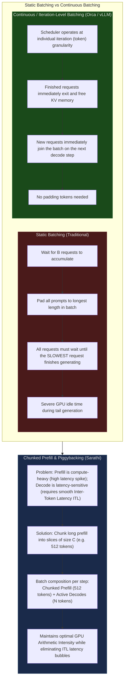

---

## 20. Implementation Complexity Spectrum — Bare Metal vs Industry Serving

| Component | Educational / Minimal Bare-Metal Engine | Production Serving Engine (vLLM / TensorRT-LLM) | Why Production Added It |
|---|---|---|---|
| **KV Cache Layout** | Contiguous static allocation (`max_seq_len`) | PagedAttention (virtual page tables, blocks of 16 tokens) | Eliminates 60–80% VRAM memory waste & fragmentation |
| **Kernel Dispatch** | Host loop calling individual CUDA kernels | CUDA Graphs (`cudaGraphLaunch`) | Drops CPU dispatch overhead from ~500 µs to ~10 µs per token |
| **Attention Kernel** | Standard GEMM or basic FlashAttention | FlashDecoding + Split-KV reduction | Prevents SM underutilization during single-token decode ($M=1$) |
| **Detokenization** | Decode complete array once at EOS | Streaming multi-byte UTF-8 accumulator state machine | Immediate token streaming without emitting corrupted bytes (`\uFFFD`) |
| **Batching Strategy** | Single-stream sequential request | Iteration-level Continuous Batching + Chunked Prefill | Eliminates padding waste and prevents prefill head-of-line blocking |
| **Generation Algorithm** | Strict 1-token-at-a-time autoregression | Speculative Decoding (Draft model + Target verify) | Breaks memory-bandwidth bottleneck to achieve 2–3× token/sec |
| **KV Cache Dtype** | FP16 / BF16 (2 bytes / element) | FP8 E4M3 / INT8 per-channel quantization | Doubles or quadruples effective context window in same VRAM |

